# Swing Remastered: library
Modernize your Java applications instantly.

**Free preview here:**
https://github.com/myvalovec/modern-java-swing-button 

Let’s be honest. Java Swing is a incredibly lightweight, but visually, it’s stuck in the 90s. I built Swing Remastered because I wanted the stability of Java with the aesthetics of a modern UI without having to use heavier JavaFX or even heavier to web technologies like Electron.

## Why Swing Remastered?
- **Lightweight & Simple:** No heavy LaF overhead. Easy usage for everyone that has basic swing knowledge
- **Zero External Depencencies:** No external downloads.
- **Source Available:** You don't just get a JAR. You also get the code.
- **Drop-in:** Works alongside standard Swing components perfectly.

# Usage
incredibly simple usage just adding one extra letter.
- JButton -> JRButton
- JFrame -> JRFrame
- works exactly the same for every component.

# Installation
- Download the JAR file.
- Add to Path: Add the JAR to your project's Build Path / Libraries.
- No Extrenal Dependencies: The library is standalone. No extra downloads required.

# Component Gallery
## JRFrame
<table>
  <tr>
    <td align="center">
      
    </td>
    <td align="center">
      
    </td>
  </tr>
  <tr>
    <td align="center"><b>Remastered</b></td>
    <td align="center"><b>Standard OS Look (uncustomizable)</b></td>
  </tr>
</table>

### Constructors:
- JRFrame()
- JRFrame(String title)
### Modified functions:
- setTitleBarBackground(Color color)
  - sets color of the title bar.
- setTitleBarForeground(Color color)
  - sets color of the frames title text.
- setTitle(String title)
- setBackground(Color color)
  - sets the background of the frame with its borders(left, right, bottom).

## JRButton
<table>
  <tr>
    <td align="center">
      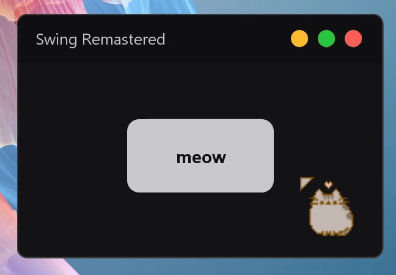
    </td>
    <td align="center">
      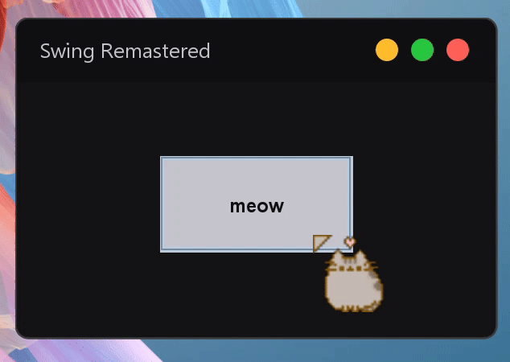
    </td>
  </tr>
  <tr>
    <td align="center"><b>Remastered</b></td>
    <td align="center"><b>Old</b></td>
  </tr>
</table>

### Constructors:
- JRButton()
- JRButton(String title)
### Modified functions:
- setRadius(int radius)
- setAnimationStep(double step)
  - sets speed of hover and press animations.
- setHoverEffectIntensity(double intensity)
  - sets intensity of hover and press animations.
- setBackground(Color bg)

## JRCheckBox
<table>
  <tr>
    <td align="center">
      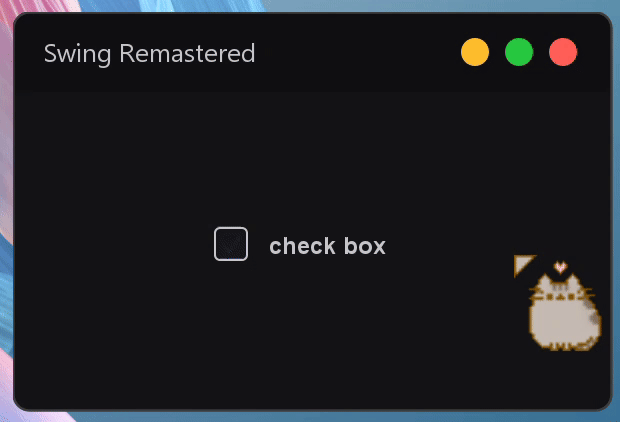
    </td>
    <td align="center">
      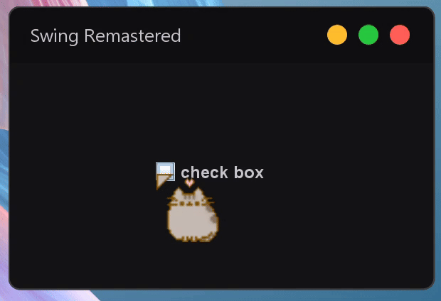
    </td>
  </tr>
  <tr>
    <td align="center"><b>Remastered</b></td>
    <td align="center"><b>Old</b></td>
  </tr>
</table>

### Constructors:
- JRCheckBox()
- JRCheckBox(String title)
### Modified functions:
- setBoxSize(int size)
- setRadius(int radius)
- setCheckStroke(float width)
- setCheckmarkOffsets(float x, float y)
- setBoxColor(Color color)
- setBorderColor(Color color)
- setCheckColor(Color color)

## JRScrollPane
<table>
  <tr>
    <td align="center">
      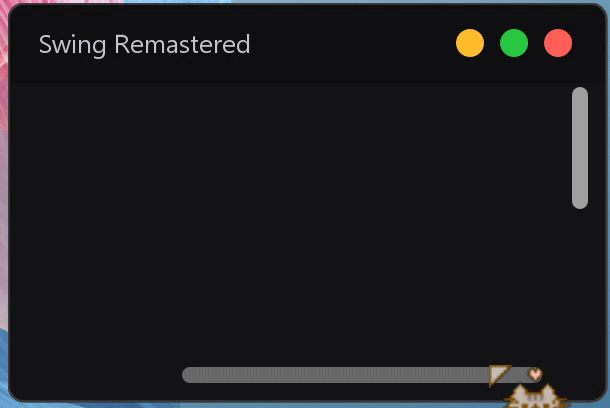
    </td>
    <td align="center">
      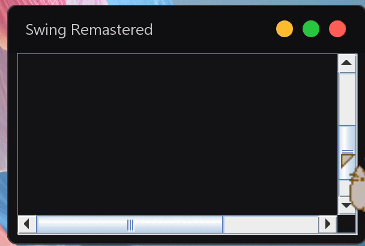
    </td>
  </tr>
  <tr>
    <td align="center"><b>Remastered</b></td>
    <td align="center"><b>Old</b></td>
  </tr>
</table>

### Constructors:
- JRScrollPane()
- JRScrollPane(Component holder)
### Modified functions:
- setBackground(Color color)
  - sets background of the scroll pane and both scrollers tracks
- setScrollWidth(int width)
- setThumbRadius(int radius)
- setThumb(Color color)
- setHover(Color color)

## JRProgressBar
<table>
  <tr>
    <td align="center">
      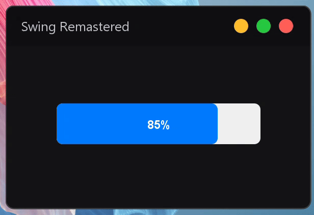
    </td>
    <td align="center">
      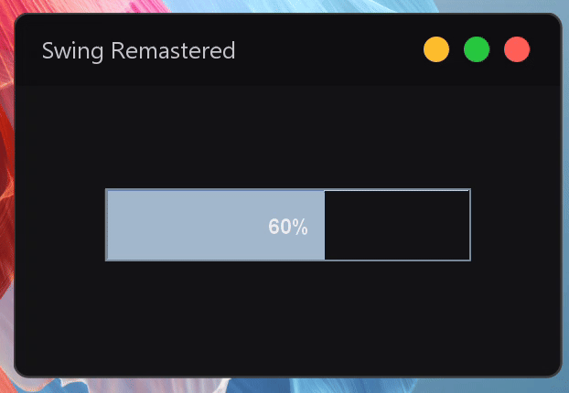
    </td>
  </tr>
  <tr>
    <td align="center"><b>Remastered</b></td>
    <td align="center"><b>Old</b></td>
  </tr>
</table>

### Constructors:
- JRProgressBar()
- JRProgressBar(int min, int max)
### Modified functions:
- setValue(int n)
- setTrackColor(Color track)
- setTextColors(Color onTrack, Color onFill)
- setRadius(int r)

## JRTextField
<table>
  <tr>
    <td align="center">
      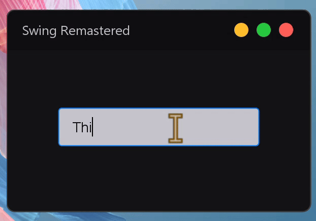
    </td>
    <td align="center">
      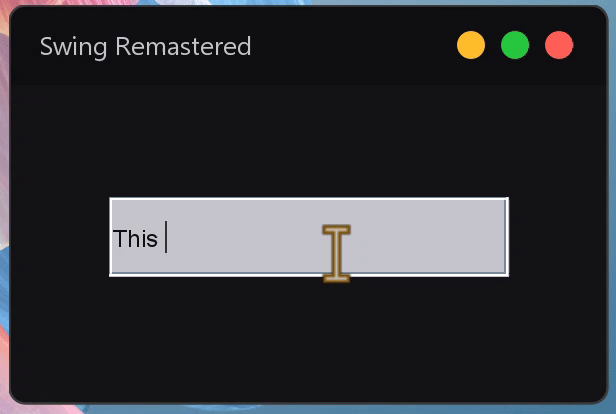
    </td>
  </tr>
  <tr>
    <td align="center"><b>Remastered</b></td>
    <td align="center"><b>Old</b></td>
  </tr>
</table>

### Constructors:
- JRTextField()
- JRTextField(String text)
- JRTextField(int columns)
- JRTextField(String text, int columns)
### Modified functions:
- setRadius(int radius)
- setAccentColor(Color color)
- setBorderColor(Color color)
- setPadding(int size)

## JRComboBox
<table>
  <tr>
    <td align="center">
      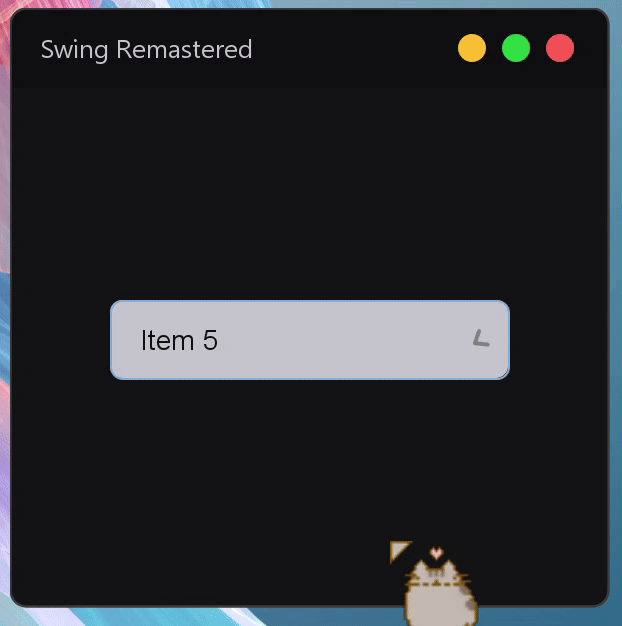
    </td>
    <td align="center">
      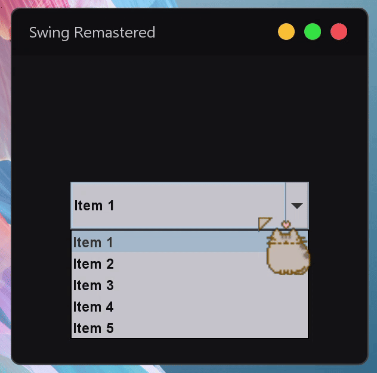
    </td>
  </tr>
  <tr>
    <td align="center"><b>Remastered</b></td>
    <td align="center"><b>Old</b></td>
  </tr>
</table>

### Constructors:
- JRComboBox()
- JRComboBox(E[] items)
### Modified functions:
- setAccentColor(Color color)
- setBackground(Color bg)
- setBorderColor(Color color)
- setRadius(int radius)

## JRPanel
<table>
  <tr>
    <td align="center">
      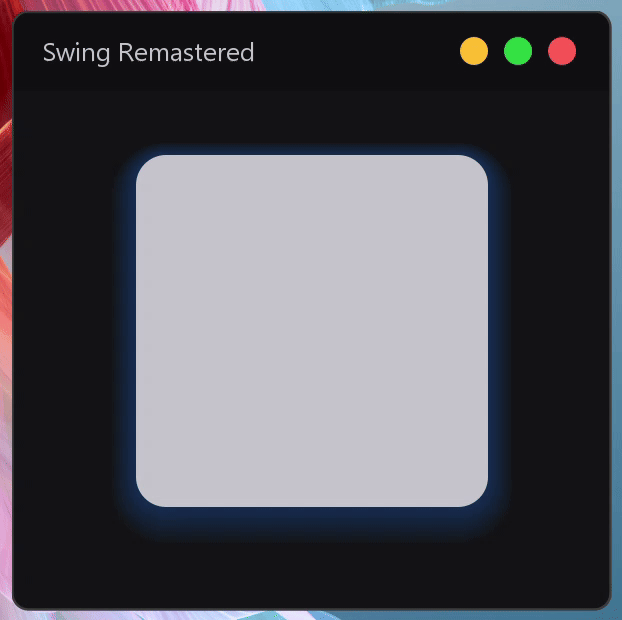
    </td>
    <td align="center">
      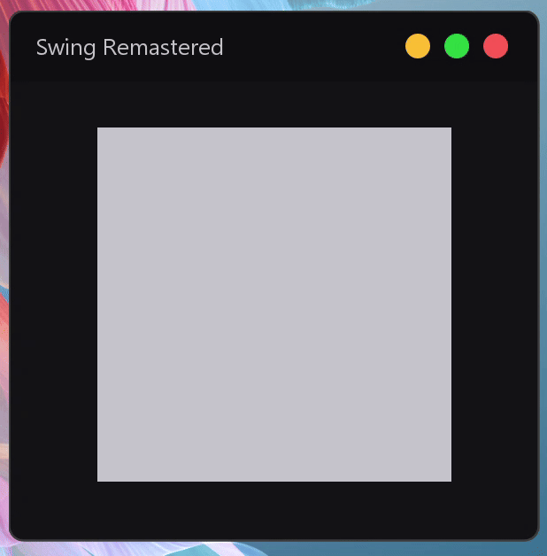
    </td>
  </tr>
  <tr>
    <td align="center"><b>Remastered</b></td>
    <td align="center"><b>Old</b></td>
  </tr>
</table>

### Constructors:
- JRPanel()
### Modified functions:
- setRadius(int radius)
- setShadowSize(int size)
- setShadowOpacity(float opacity)
- setShadowColor(Color color)
- setBackground(Color bg)

# Pricing & Access
Swing Remastered is a **Paid Source-Available** library.
To keep the price accessible, I handle sales manually to avoid platform fees.

### What is included?
- **Full Source Code Access** (Private GitHub Repo)
- **Unlimited Lifetime Updates** (One-time purchase. No subscriptions. Ever.)
- **Direct Email Support** (I personally help with integration and bug fixes)

## Pricing
**Individual**
- **€10.00**
- Strictly for non-profit, educational, or personal hobby projects.

**Entity**
- **€50.00**
- **MANDATORY** for commercial apps, freelancers, or any profit-generating use.

### EU Option A: EU Residents (Bank Transfer)
1. **[Click here to view Bank Details (IBAN/SWIFT)](https://gist.github.com/myvalovec/bd77526658f25e657b0668919ee3d23c)**
2. Please write your **GitHub Username** in the payment message.
3. Email swingremastered@gmail.com with a photo confirmation and your GitHub Username.

> **Note:**
> Access to the private repository is granted **within 24 hours** of the payment being credited to the account.

### NON-EU Option B:
Please email swingremastered@gmail.com with the subject **"Purchase Non-EU"**.
I will reply shortly with the payment details.

### License & Legal
**Copyright (c) 2025 - Present Luděk Hanzík.**

**This is NOT Open Source software.**
Swing Remastered is a **proprietary, commercial library**.

* **Allowed:** Modifying source code for licensed projects, embedding in compiled apps.
* **Prohibited:** Redistributing source code, reselling, or AI training.

Full terms are available in the [LICENSE](LICENSE) file.
